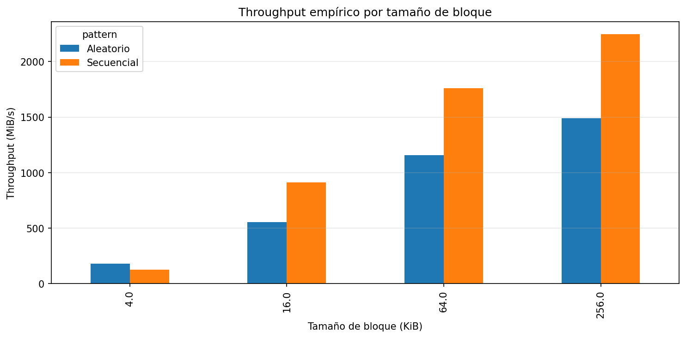
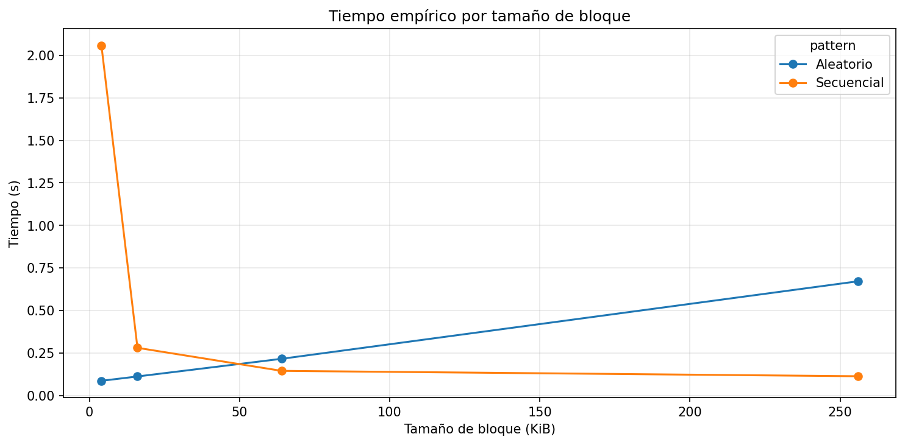
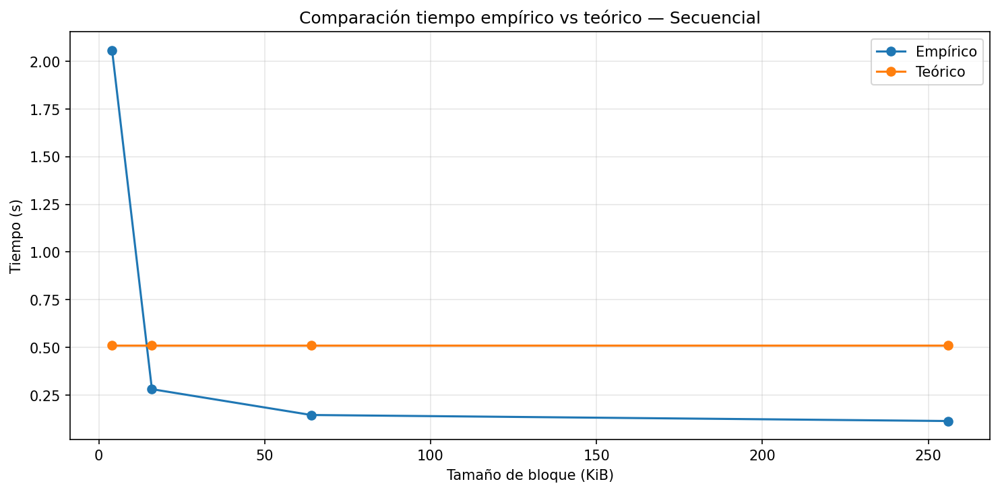
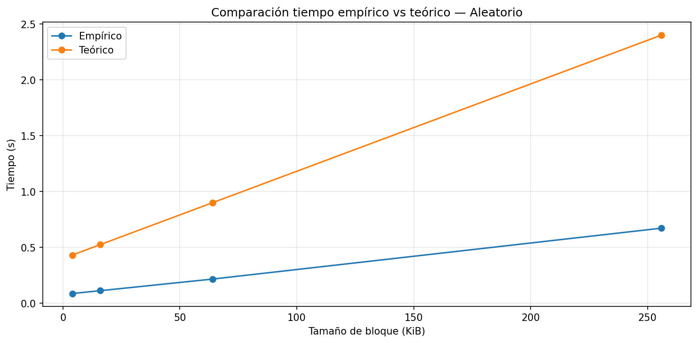
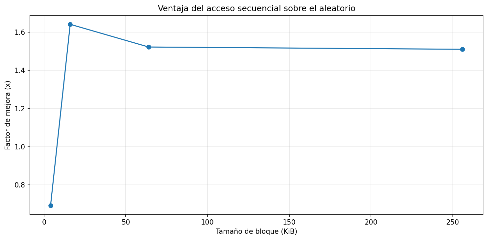

# lab3-IO_performance-NicoleAdarve

## INFORME LAB 3 ##

### 1. Especificaciones del equipo ###
Descripción del sistema

| Parámetro | Valor de Referencia |
| --- | --- |
| **Sistema Operativo** | Windows 11 |
| **CPU (Modelo y Núcleos)** | Intel(R) Celeron(R) N4020 CPU @ 1.10GHz   |
| **Memoria RAM Total** | **8 GB**    |
| **Tipo de Disco** | ADATA SU650  SSD       SATA |
| **Carga de CPU en Reposo** |  6% |
| Espacio libre en disco | **137 GB**                |

## 2. Resultados del experimento  ##

Las gráficas obtenidas muestran cómo el rendimiento del sistema de almacenamiento varía según el patrón de acceso y el tamaño de bloque. En términos generales, se observa que el throughput aumenta a medida que crece el tamaño del bloque, lo cual indica que el sistema aprovecha mejor el ancho de banda del disco cuando se transfieren mayores cantidades de datos por operación.

**Throughput por tamaño de bloque**

En el caso del acceso secuencial, se evidencia un crecimiento significativo del throughput, pasando de aproximadamente 124.44 MiB/s en bloques de 4 KB a cerca de 2247.90 MiB/s en bloques de 256 KB. Esto se debe a que este tipo de acceso aprovecha la localidad espacial, permitiendo leer datos contiguos y reduciendo la cantidad de operaciones de I/O necesarias, lo que disminuye el impacto de la latencia.

Por otro lado, el acceso aleatorio también presenta un incremento en el throughput al aumentar el tamaño del bloque (de 179.50 MiB/s a 1488.17 MiB/s), pero su rendimiento es menor en comparación con el acceso secuencial. Esto se explica porque cada lectura implica ubicaciones dispersas en el almacenamiento, lo que incrementa el costo de acceso debido a la latencia del dispositivo.

En la gráfica de tiempo se observa un comportamiento complementario: el acceso secuencial reduce significativamente el tiempo total al aumentar el tamaño del bloque (de 2.05 s a 0.11 s), mientras que el acceso aleatorio muestra un aumento en el tiempo (de 0.087 s a 0.67 s). Esto refleja claramente la diferencia en el modelo de costo de I/O, donde el acceso aleatorio incurre en múltiples operaciones independientes.

**Tiempo por tamaño de bloque**

La comparación entre resultados teóricos y empíricos permite observar que, en el caso del acceso secuencial, el modelo teórico tiende a sobreestimar el tiempo real, mientras que en el acceso aleatorio se presentan mayores variaciones. Esto indica que el modelo simplificado no captura completamente optimizaciones reales como la caché del sistema o el comportamiento interno del SSD.

**Comparación tiempo teórico vs práctico (secuencial)**

**Comparación tiempo teórico vs práctico (aleatorio)**

Finalmente, la gráfica de speedup muestra que el acceso secuencial puede ser hasta 1.64 veces más rápido que el aleatorio, especialmente en bloques de tamaño intermedio (16 KB). Esto confirma que la eficiencia del sistema depende tanto del tamaño del bloque como del patrón de acceso utilizado.

**Ventaja del acceso secuencial (speedup)**
.

## 3. Análisis y conclusiones ##
Conclusiones:  La información en disco se almacena en bloques, y esto es importante porque el rendimiento no depende solo de cuántos datos se leen, sino también de cómo están organizados y del patrón de acceso utilizado. En este laboratorio se comprobó que el acceso secuencial suele ser más eficiente que el acceso aleatorio, ya que permite leer datos contiguos y reducir la cantidad de accesos costosos al almacenamiento. En mis resultados, por ejemplo, el mayor factor de mejora del acceso secuencial fue de 1.64x con bloques de 16 KB, y además se alcanzó un throughput secuencial de 2247.90 MiB/s con bloques de 256 KB. Aunque el equipo usado tiene un SSD SATA, el acceso aleatorio siguió siendo más costoso debido a la latencia del controlador, la dispersión de los datos y la menor eficiencia al manejar múltiples lecturas independientes. El modelo teórico fue útil como referencia general para entender la tendencia esperada, pero no representó exactamente el comportamiento real, ya que en varios casos sobreestimó el tiempo medido. Esto puede explicarse por factores como la caché del sistema operativo y optimizaciones internas del SSD. Con base en estos resultados, en un sistema real tomaría la decisión de organizar los datos de forma contigua y favorecer lecturas secuenciales, especialmente en aplicaciones como motores de bases de datos, donde minimizar el costo de I/O mejora notablemente el desempeño.

## 4. Respuestas a preguntas de cierre ##

**4.1 Comparación de patrones:** Con base en sus mediciones, ¿cuántas
   veces más rápido fue el acceso secuencial respecto al aleatorio en
   su equipo? ¿Ese resultado era el esperado según la teoría?

- Respuesta: En mis mediciones, el acceso secuencial fue aproximadamente hasta 1.64 veces más rápido que el acceso aleatorio, especialmente en bloques de 16 KB. Este resultado sí era esperado según la teoría, ya que el acceso secuencial reduce la cantidad de accesos al disco y aprovecha mejor la lectura continua de datos.

**4.2 Efecto del tamaño de bloque:** ¿Qué ocurrió con el throughput del
   acceso aleatorio a medida que aumentó el tamaño de bloque?
   ¿Por qué cree que sucede eso?

- Respuesta: El throughput del acceso aleatorio aumentó a medida que creció el tamaño de bloque. Por ejemplo, pasó de aproximadamente 179.50 MiB/s en 4 KB a cerca de 1488.17 MiB/s en 256 KB. Esto sucede porque al leer bloques más grandes se reduce la cantidad de accesos independientes al disco, disminuyendo el impacto de la latencia.

**4.3 Teoría vs práctica:** Identifique un caso en sus resultados donde
   la medición empírica se alejó del modelo teórico. ¿A qué factor
   atribuye esa diferencia?

- Respuesta: Un caso donde la medición empírica se alejó del modelo teórico fue en el acceso secuencial con bloques de 256 KB, donde el tiempo empírico fue de aproximadamente 0.11 s, mientras que el modelo teórico estimaba alrededor de 0.51 s. Esta diferencia puede atribuirse a factores como la caché del sistema operativo y las optimizaciones internas del SSD, que no están contempladas en el modelo teórico simplificado.

**4.4 Tipo de disco:** Compare sus resultados con los valores de referencia
   de la tabla de la guía. ¿Su equipo se comportó como un HDD, un SSD
   SATA o un SSD NVMe?

- Respuesta: 
Tabla de referencia:

| Tecnología | Latencia Promedio | Throughput Típico | IOPS Típico (4 KB aleatorio) | Escala de Tiempo |
| --- | --- | --- | --- | --- |
| **HDD** | 10 ms | 100 - 150 MB/s | 75 – 300 | Milisegundos |
| **SSD (SATA)** | 100 µs | 500 - 550 MB/s | 50,000 – 100,000 | Microsegundos |
| **SSD NVMe** | 10 - 20 µs | 2 - 7 GB/s | 500,000 – 1,000,000+ | Microsegundos |

Mis resultados se asemejan más al comportamiento de un SSD SATA, ya que el throughput obtenido (hasta aproximadamente 2247.90 MiB/s en secuencial) y los tiempos medidos son mucho mejores que los de un HDD, pero no alcanzan completamente el rendimiento ideal de un SSD NVMe. Además, el comportamiento del acceso aleatorio confirma la presencia de latencias típicas de un SSD.

**4.5 Aplicación práctica:** Imagine que debe almacenar una tabla de
   estudiantes con 1 millón de registros. Con base en lo que midió,
   ¿preferiría leerla toda de forma secuencial o acceder a registros
   individuales de forma aleatoria? ¿Por qué?

- Respuesta: Preferiría leer la tabla de forma secuencial, ya que este patrón demostró ser más eficiente en términos de tiempo y throughput. Como se observó en los resultados, el acceso secuencial puede ser hasta 1.64 veces más rápido, lo que es especialmente importante cuando se manejan grandes volúmenes de datos como un millón de registros. El acceso aleatorio implicaría múltiples accesos dispersos, aumentando la latencia y reduciendo el rendimiento.